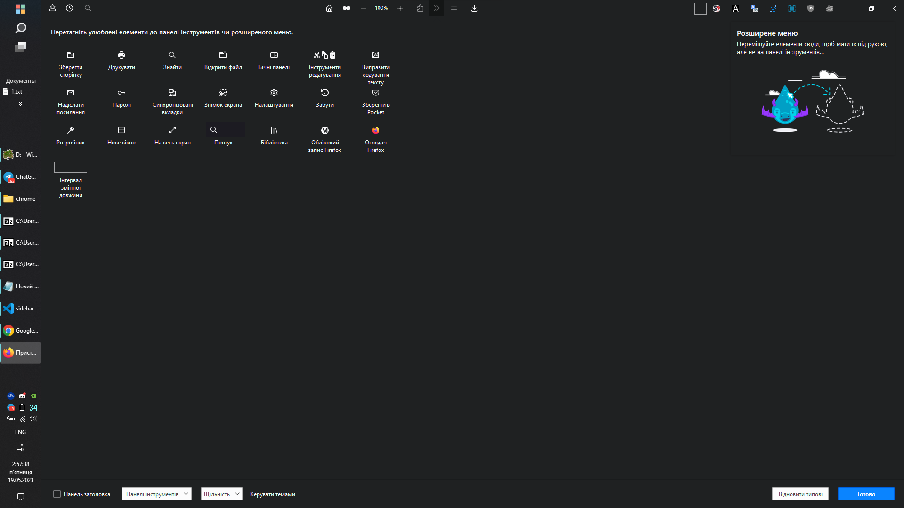
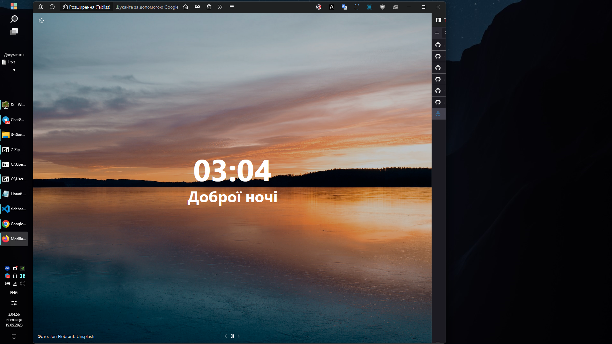
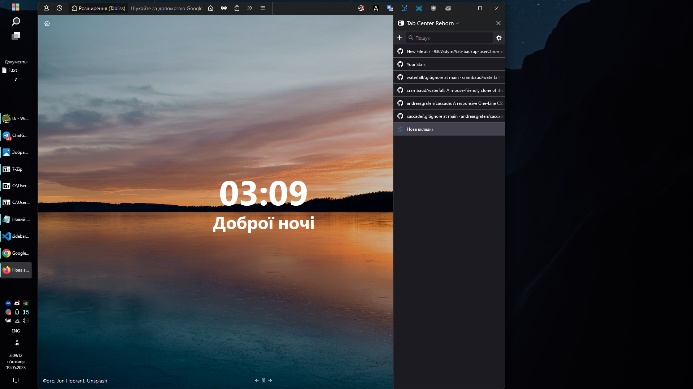
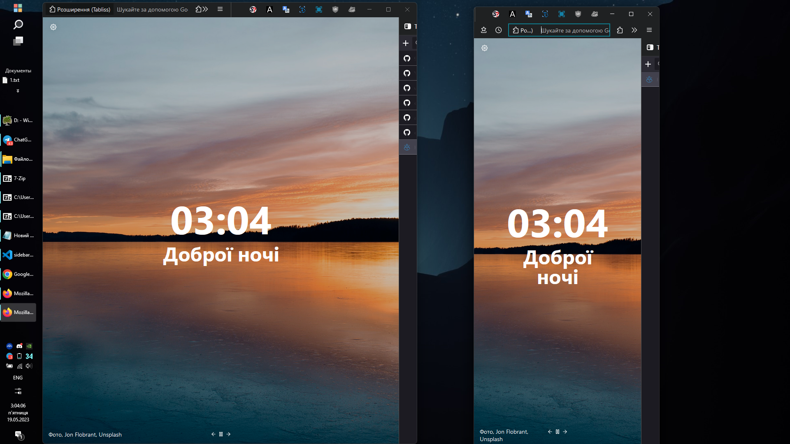

В першу чергу це трохи перероблена під себе тема Waterfall (https://github.com/crambaud/waterfall). Тому рекомендую спочатку завітати туди. Також можливо щось було скопійовано з одного із тих файлі або строків коду: https://github.com/andreasgrafen/cascade (на жаль він в мене не працював, ймовірно щось (сам не знаю) робив не так(багато чого:D))
Я є сама звичайна людина. Далеко не программіст, це все здебільшого копіпаста. Мені не треба проблем. Якщо що - користуйтесь на здоров'я, а ні так скажіть, приберу. 

Бокова панель:
https://addons.mozilla.org/uk/firefox/addon/tabcenter-reborn/?utm_content=addons-manager-reviews-link&utm_medium=firefox-browser&utm_source=firefox-browser

